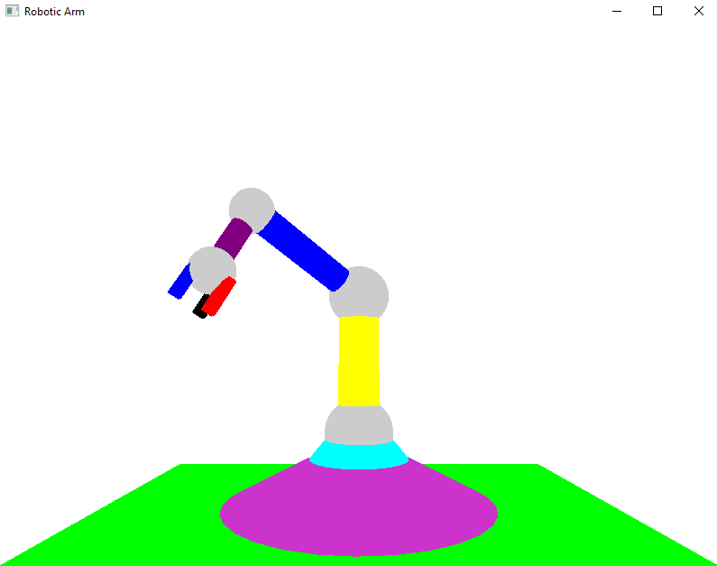

# 3D Robotic Arm

Este repositório contém um projeto em OpenGL para desenhar um braço robótico em 3D. O usuário pode interagir com o braço robótico e rotacionar suas partes utilizando as teclas especificadas.

## Captura de tela

  

## Funcionalidades

- **Rotação do ombro:**
  - Tecla `o`: Rotaciona o ombro no sentido horário.
  - Tecla `O`: Rotaciona o ombro no sentido anti-horário.
  
- **Rotação do cotovelo:**
  - Tecla `c`: Rotaciona o cotovelo no sentido horário.
  - Tecla `C`: Rotaciona o cotovelo no sentido anti-horário.
  
- **Rotação da mão:**
  - Tecla `m`: Rotaciona a mão no sentido horário.
  - Tecla `M`: Rotaciona a mão no sentido anti-horário.
  
- **Rotação do polegar:**
  - Tecla `p`: Rotaciona o polegar no sentido horário.
  - Tecla `P`: Rotaciona o polegar no sentido anti-horário.
  
- **Rotação do dedo indicador:**
  - Tecla `i`: Rotaciona o dedo indicador no sentido horário.
  - Tecla `I`: Rotaciona o dedo indicador no sentido anti-horário.
  
- **Rotação do dedo anelar:**
  - Tecla `a`: Rotaciona o dedo anelar no sentido horário.
  - Tecla `A`: Rotaciona o dedo anelar no sentido anti-horário.
  
- **Rotação de todo o braço em torno do eixo Y:**
  - Tecla `y`: Rotaciona o braço no sentido horário.
  - Tecla `Y`: Rotaciona o braço no sentido anti-horário.
  
- **Sair do programa:**
  - Tecla `ESC`: Fecha o programa.

## Contribuição

Sinta-se à vontade para abrir issues ou enviar pull requests. Toda contribuição é bem-vinda!

## Licença

Este projeto está licenciado sob a Licença MIT - veja o arquivo [LICENSE](LICENSE) para mais detalhes.
